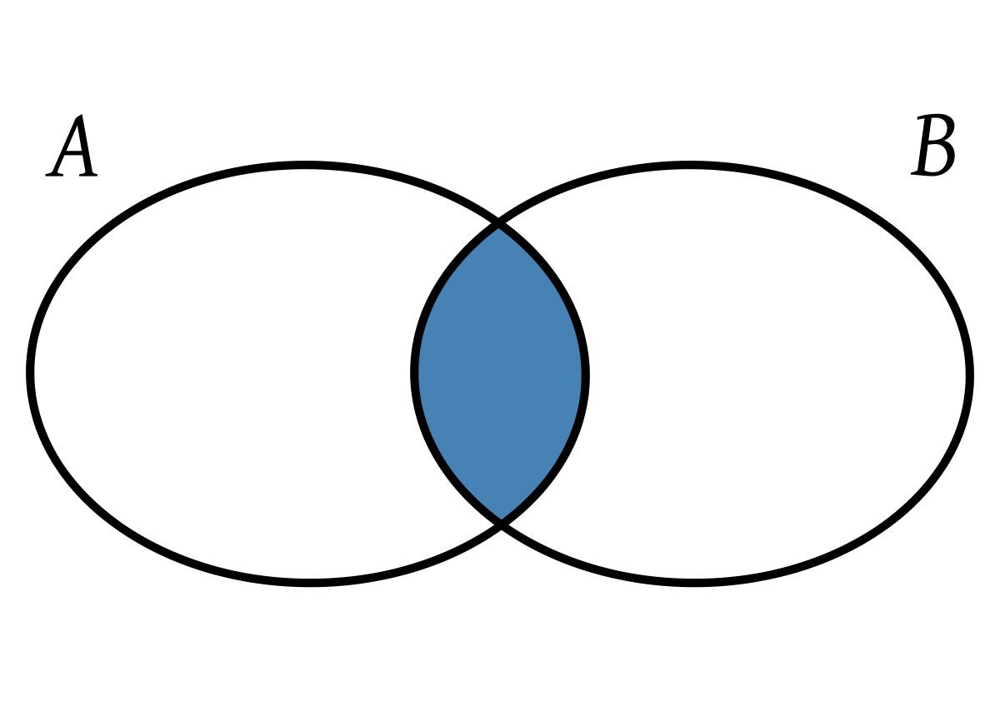
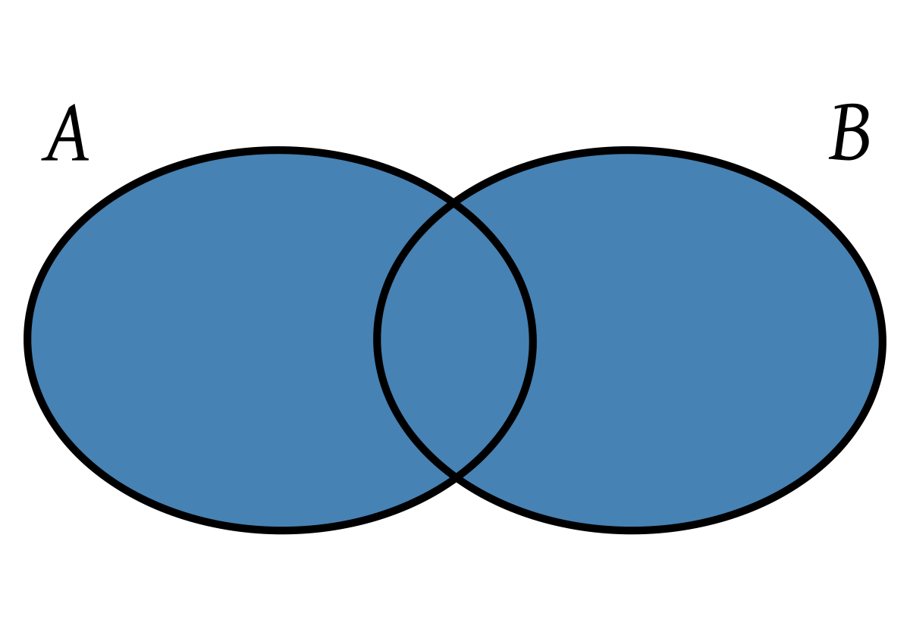

# 파이썬으로 집합 다루기 (합집합, 교집합, 집합)

## Set
파이썬 리스트에서 중복을 없애주는 `set` 가 있다. 이 `set`을 리스트에 적용을 하면 해당 리스트에서 중복 데이터를 제거하고 `set`(집합) 자료형을 리턴한다.

```python
num1 = [1, 2, 3, 3, 3, 5, 5, 5, 6, 6]
set(num1)
>>> set([1, 2, 3, 5, 6])
```

`set`의 특징은 1) 중복이 없고, 2) 순서가 없다는 것이다.

## 교집합 (intersection)

교집합을 구할 때도 `set`을 사용한다. 두 리스트에서 서로 겹치는 값들만 추출하고 싶을 때 교집합을 구한다. 

```python
num1 = set([1, 5, 5, 9, 9, 11, 3, 12])
num2 = set([5, 3, 1, 9, 14, 6, 15, 2])
intersection = num1 & num2
>>> set([1, 3, 5, 9])
```

`&`라는 연산자를 사용해서 서로 겹치는 값을 얻을 수 있다. `&` 연산자 이전에 `set`으로 중복을 없앤다. `&` 말고도 python의 built-in 함수를 사용해서 같은 결과를 도출할 수 있다. 

```python
num1.intersection(num2) # num2.intersection(num1) 해도 같다
>>> set([1, 3, 5, 9])
```


## 합집합 (union)

합집합 구할 때도 `set`을 사용한다. 합집합은 두 리스트 모든 데이터를 하나로 묶는 것을 말한다. 

```python
num1 = set([1, 5, 5, 9, 9, 11, 3, 12])
num2 = set([5, 3, 1, 9, 14, 6, 15, 2])
union = num1 | num2
>>>set([1, 2, 3, 5, 6, 9, 11, 12, 14, 15])
```

`|` or 연산자를 사용해서 리스트 1에 있던지 혹은 리스트 2에 있던지 둘 중 하나에 있으면 리스트에 추가를 한다. `|` 연산자 말고도 union 함수를 사용해도 결과는 같다.

```python
num1.union(num2) # num2.union(num1) 해도 같다
>>>set([1, 2, 3, 5, 6, 9, 11, 12, 14, 15])
```

다만, 여기서의 문제점은 리스트 1에도 있고 리스트 2에도 있는 경우에 한번만 나온다는 것이다. OR이기 때문에 둘 중 하나에만 있으면 값을 하나만 추가하는 것이다. 그래서 리스트간 중복되는 값을 다 보이게 하고 싶으면 `set`을 `list`로 만들고 `+` 연산자를 사용하면 된다. 

```python
num1 = set([1, 5, 5, 9, 9, 11, 3, 12])
num2 = set([5, 3, 1, 9, 14, 6, 15, 2])
union = list(num1) + list(num2)
>>>[1, 3, 5, 9, 11, 12, 1, 2, 3, 5, 6, 9, 14, 15]
```
